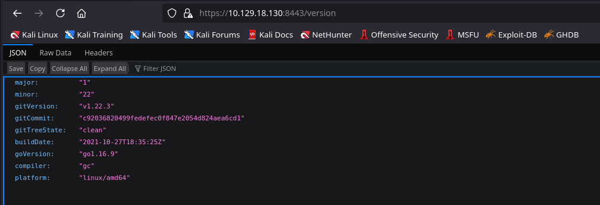

# Steam Cloud

## Rust Scan

```bash
rustscan -t 2000 --ulimit 5000 -a $IP
```

```console
PORT      STATE SERVICE     REASON
22/tcp    open  ssh         syn-ack ttl 63
2379/tcp  open  etcd-client syn-ack ttl 63
2380/tcp  open  etcd-server syn-ack ttl 63
8443/tcp  open  https-alt   syn-ack ttl 63
10249/tcp open  unknown     syn-ack ttl 63
10250/tcp open  unknown     syn-ack ttl 63
10256/tcp open  unknown     syn-ack ttl 63
```

## NMAP

```bash
nmap -sC -sV -Pn -vv -p- $IP --open
```

```console
PORT STATE SERVICE REASON VERSION

22/tcp open ssh syn-ack ttl 63 OpenSSH 7.9p1 Debian 10+deb10u2 (protocol 2.0)

| ssh-hostkey:

| 2048 fc:fb:90:ee:7c:73:a1:d4:bf:87:f8:71:e8:44:c6:3c (RSA)

| ssh-rsa AAAAB3NzaC1yc2EAAAADAQABAAABAQCu4TNCZjLe74tZ0HyspkMaghndsvuXkZJa4lJBt9arqgkm6u2HI/RRdwbjE14au2u/YF89y23Q55iOGraA+9JjpyTzDPo3kxE/RisYzJaUDmzza+hqEeyTxXkZby9+DAhKm5UXs7M2CMDr3cwOPPQ96u/zUX0gDG3CfYw4fAi2TDGa6jU5KmGzIQz6SQR3Bv6IYLDwzNJ0nHNZ3jxSbFS3SsmTwK749GJLrv62wAf4uUL/Ihynl8cCG5aor6T0Fk44v/9ndfujznBvWaMYVPpf9B49XlD7OhXB5pCK2nPZrdze+ch6yhAM/vYrYA4sNk3IuFG3OCrDkVeUJn5sJKx5

| 256 46:83:2b:1b:01:db:71:64:6a:3e:27:cb:53:6f:81:a1 (ECDSA)

| ecdsa-sha2-nistp256 AAAAE2VjZHNhLXNoYTItbmlzdHAyNTYAAAAIbmlzdHAyNTYAAABBBHVj7iKnl8SWdGz6J4F3kvpZjM1Tim0iHlUnQByS8xJYnfwttLxVwGb+aaGbRhOJu4mq9y4crwFh50rC9mAEHWo=

| 256 1d:8d:d3:41:f3:ff:a4:37:e8:ac:78:08:89:c2:e3:c5 (ED25519)

|_ssh-ed25519 AAAAC3NzaC1lZDI1NTE5AAAAIHXIZpU9XbtZ2zvx8rFEYTfGp+8JCJx5lSiRNEcqUFG8

2379/tcp open ssl/etcd-client? syn-ack ttl 63

| ssl-cert: Subject: commonName=steamcloud

| Subject Alternative Name: DNS:localhost, DNS:steamcloud, IP Address:10.129.18.130, IP Address:127.0.0.1, IP Address:0:0:0:0:0:0:0:1

| Issuer: commonName=etcd-ca

|_ssl-date: TLS randomness does not represent time

| tls-alpn:

|_ h2

2380/tcp open ssl/etcd-server? syn-ack ttl 63

| tls-alpn:

|_ h2

|_ssl-date: TLS randomness does not represent time

| ssl-cert: Subject: commonName=steamcloud

| Subject Alternative Name: DNS:localhost, DNS:steamcloud, IP Address:10.129.18.130, IP Address:127.0.0.1, IP Address:0:0:0:0:0:0:0:1

8443/tcp open ssl/http syn-ack ttl 63 Golang net/http server

| ssl-cert: Subject: commonName=minikube/organizationName=system:masters

| Subject Alternative Name: DNS:minikubeCA, DNS:control-plane.minikube.internal, DNS:kubernetes.default.svc.cluster.local, DNS:kubernetes.default.svc, DNS:kubernetes.default, DNS:kubernetes, DNS:localhost, IP Address:10.129.18.130, IP Address:10.96.0.1, IP Address:127.0.0.1, IP Address:10.0.0.1

| Issuer: commonName=minikubeCA

| tls-alpn:

| h2

|_ http/1.1

|_ssl-date: TLS randomness does not represent time

| fingerprint-strings:

| FourOhFourRequest:

| HTTP/1.0 403 Forbidden

| Audit-Id: 7d7796bd-c17f-4c41-a608-b34126204192

| Cache-Control: no-cache, private

| Content-Type: application/json

| X-Content-Type-Options: nosniff

| X-Kubernetes-Pf-Flowschema-Uid: 6298d75d-a5a6-46cf-8b34-8a8d2eba6068

| X-Kubernetes-Pf-Prioritylevel-Uid: 23c3589d-c7ba-409a-827a-bc0ad15fea2f

| Date: Sat, 21 Jun 2025 06:53:48 GMT

| Content-Length: 212

| {"kind":"Status","apiVersion":"v1","metadata":{},"status":"Failure","message":"forbidden: User "system:anonymous" cannot get path "/nice ports,/Trinity.txt.bak"","reason":"Forbidden","details":{},"code":403}

| GetRequest:

| HTTP/1.0 403 Forbidden

| Audit-Id: 04191287-7bdf-4759-85d5-f518d63b11d9

| Cache-Control: no-cache, private

| Content-Type: application/json

| X-Content-Type-Options: nosniff

| X-Kubernetes-Pf-Flowschema-Uid: 6298d75d-a5a6-46cf-8b34-8a8d2eba6068

| X-Kubernetes-Pf-Prioritylevel-Uid: 23c3589d-c7ba-409a-827a-bc0ad15fea2f

| Date: Sat, 21 Jun 2025 06:53:48 GMT

| Content-Length: 185

| {"kind":"Status","apiVersion":"v1","metadata":{},"status":"Failure","message":"forbidden: User "system:anonymous" cannot get path "/"","reason":"Forbidden","details":{},"code":403}

| HTTPOptions:

| HTTP/1.0 403 Forbidden

| Audit-Id: 1e44111b-8646-403b-bd71-d0beb1c47bea

| Cache-Control: no-cache, private

| Content-Type: application/json

| X-Content-Type-Options: nosniff

| X-Kubernetes-Pf-Flowschema-Uid: 6298d75d-a5a6-46cf-8b34-8a8d2eba6068

| X-Kubernetes-Pf-Prioritylevel-Uid: 23c3589d-c7ba-409a-827a-bc0ad15fea2f

| Date: Sat, 21 Jun 2025 06:53:48 GMT

| Content-Length: 189

|_ {"kind":"Status","apiVersion":"v1","metadata":{},"status":"Failure","message":"forbidden: User "system:anonymous" cannot options path "/"","reason":"Forbidden","details":{},"code":403}

|_http-title: Site doesn't have a title (application/json).

10249/tcp open http syn-ack ttl 63 Golang net/http server (Go-IPFS json-rpc or InfluxDB API)

|_http-title: Site doesn't have a title (text/plain; charset=utf-8).

10250/tcp open ssl/http syn-ack ttl 63 Golang net/http server (Go-IPFS json-rpc or InfluxDB API)

|_ssl-date: TLS randomness does not represent time

| tls-alpn:

| h2

|_ http/1.1

|_http-title: Site doesn't have a title (text/plain; charset=utf-8).

| ssl-cert: Subject: commonName=steamcloud@1750488536

| Subject Alternative Name: DNS:steamcloud

| Issuer: commonName=steamcloud-ca@1750488536

10256/tcp open http syn-ack ttl 63 Golang net/http server (Go-IPFS json-rpc or InfluxDB API)

| http-methods:

|_ Supported Methods: GET HEAD POST OPTIONS

|_http-title: Site doesn't have a title (text/plain; charset=utf-8).

Service Info: OS: Linux; CPE: cpe:/o:linux:linux_kernel
```


## Web

* Fuzzing the 8443 port

```bash
dirsearch -u $URL -x 404
```

```console
[12:28:41] 200 -    2B  - /healthz
[12:29:17] 200 -  263B  - /version
[12:29:17] 200 -  263B  - /version/ 
```

