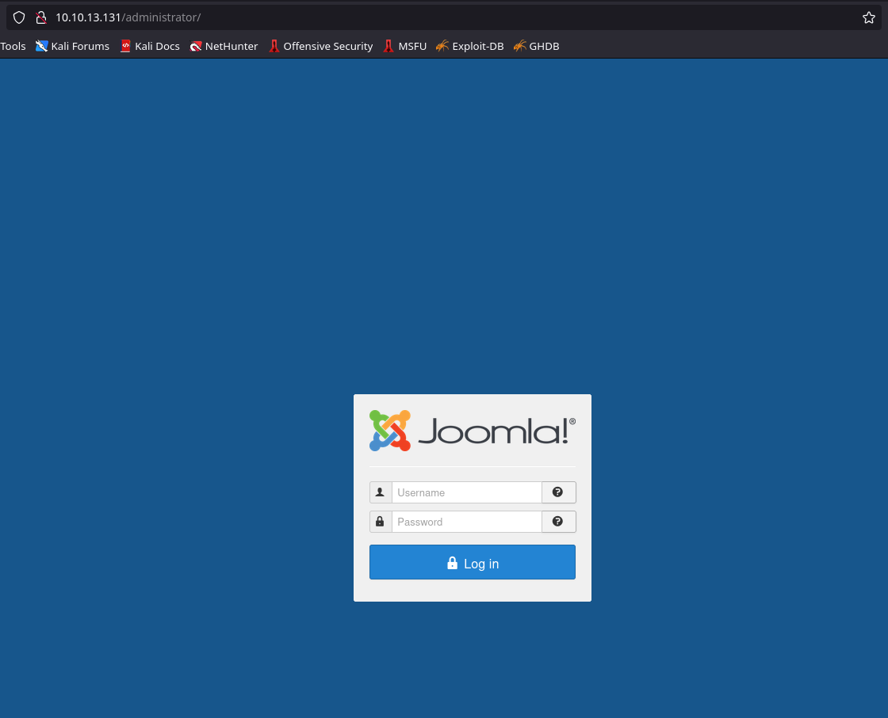
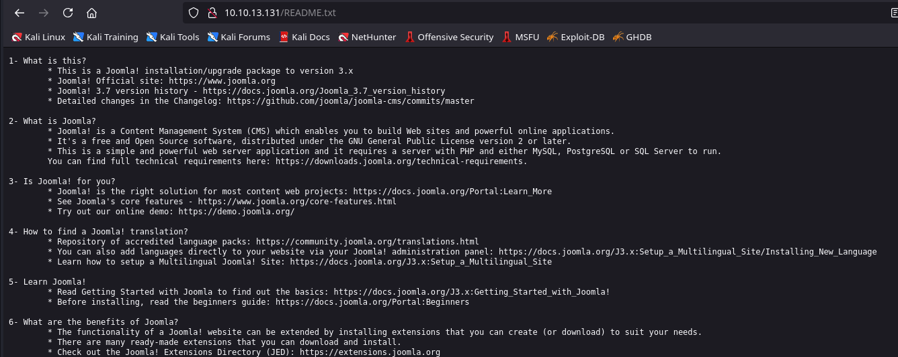
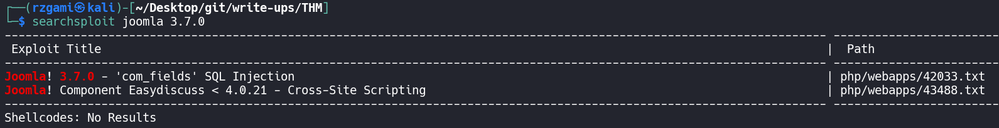
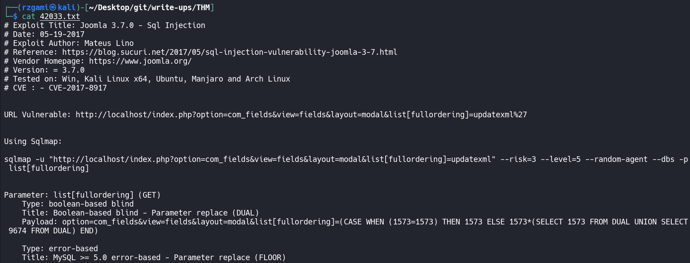
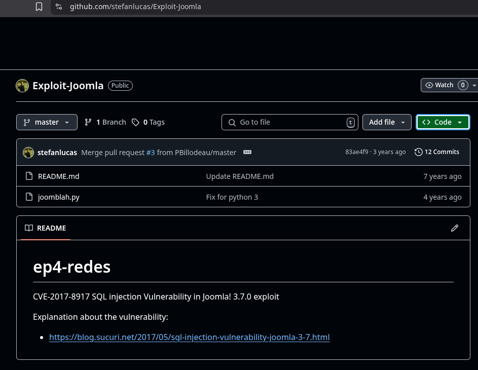
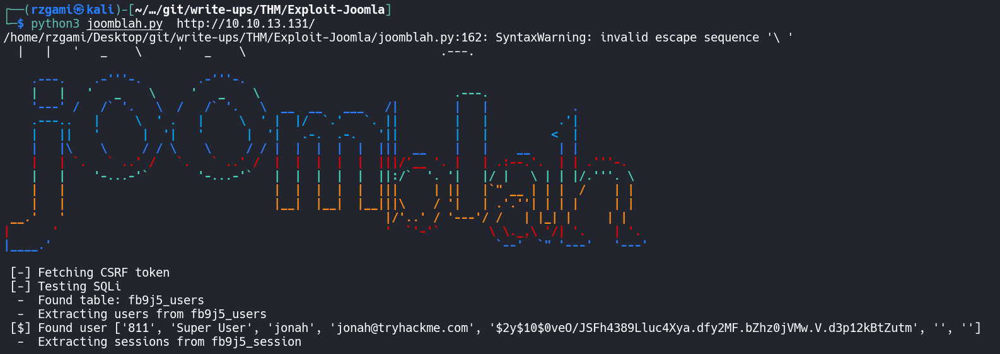
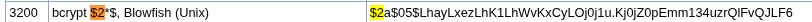
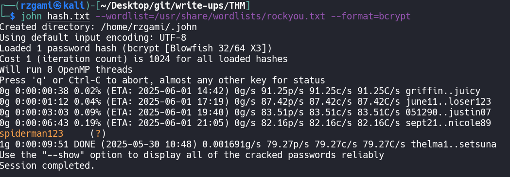

## Daily Bugle

### NMAP scan

```console
PORT     STATE SERVICE REASON
22/tcp   open  ssh     syn-ack ttl 63
80/tcp   open  http    syn-ack ttl 63
3306/tcp open  mysql   syn-ack ttl 63
```

```console

PORT     STATE SERVICE REASON         VERSION
22/tcp   open  ssh     syn-ack ttl 63 OpenSSH 7.4 (protocol 2.0)
80/tcp   open  http    syn-ack ttl 63 Apache httpd 2.4.6 ((CentOS) PHP/5.6.40)
|_http-server-header: Apache/2.4.6 (CentOS) PHP/5.6.40    
|_http-title: Home                                   
| http-robots.txt: 15 disallowed entries       
| /joomla/administrator/ /administrator/ /bin/ /cache/
| /cli/ /components/ /includes/ /installation/ /language/ 
|_/layouts/ /libraries/ /logs/ /modules/ /plugins/ /tmp/
|_http-generator: Joomla! - Open Source Content Management
|_http-favicon: Unknown favicon
| http-methods: 
|_  Supported Methods: GET HEAD POST OPTIONS
3306/tcp open  mysql   syn-ack ttl 63 MariaDB 10.3.23 or earlier (unauthorized)
```

### Web


* As per the nmap scan result there appears to be a robots.txt, taking a closer look at the endpoints mentioned in it.

```console
Disallow: /administrator/
Disallow: /bin/
Disallow: /cache/
Disallow: /cli/
Disallow: /components/
Disallow: /includes/
Disallow: /installation/
Disallow: /language/
Disallow: /layouts/
Disallow: /libraries/
Disallow: /logs/
Disallow: /modules/
Disallow: /plugins/
Disallow: /tmp/
```

* Upon viewing the administrator page we find out the underlying cms is joomla.




* This further prompts us to fuzz and uncover if there are any other interesting directories over this cms.

```bash
dirsearch -u $URL -x 404
```

```console
[10:14:46] 301 -  242B  - /administrator  ->  http://10.10.13.131/administrator/
[10:14:46] 200 -   31B  - /administrator/cache/
[10:14:46] 200 -    5KB - /administrator/
[10:14:46] 200 -    2KB - /administrator/includes/
[10:14:46] 200 -    5KB - /administrator/index.php
[10:14:46] 301 -  247B  - /administrator/logs  ->  http://10.10.13.131/administrator/logs/
[10:14:46] 200 -   31B  - /administrator/logs/
[10:14:56] 301 -  232B  - /bin  ->  http://10.10.13.131/bin/
[10:14:56] 200 -   31B  - /bin/                
[10:14:58] 200 -   31B  - /cache/
[10:14:58] 301 -  234B  - /cache  ->  http://10.10.13.131/cache/            
[10:14:59] 403 -  210B  - /cgi-bin/
[10:15:01] 200 -   31B  - /cli/
[10:15:03] 301 -  239B  - /components  ->  http://10.10.13.131/components/  
[10:15:03] 200 -   31B  - /components/
[10:15:04] 200 -    0B  - /configuration.php
[10:15:25] 200 -    3KB - /htaccess.txt
[10:15:26] 301 -  235B  - /images  ->  http://10.10.13.131/images/          
[10:15:26] 200 -   31B  - /images/
[10:15:27] 301 -  237B  - /includes  ->  http://10.10.13.131/includes/      
[10:15:27] 200 -   31B  - /includes/
[10:15:28] 200 -    9KB - /index.php
[10:15:32] 301 -  237B  - /language  ->  http://10.10.13.131/language/      
[10:15:32] 200 -   31B  - /layouts/
[10:15:33] 301 -  238B  - /libraries  ->  http://10.10.13.131/libraries/    
[10:15:33] 200 -   31B  - /libraries/
[10:15:34] 200 -   18KB - /LICENSE.txt
[10:15:38] 301 -  234B  - /media  ->  http://10.10.13.131/media/            
[10:15:38] 200 -   31B  - /media/
[10:15:41] 301 -  236B  - /modules  ->  http://10.10.13.131/modules/        
[10:15:41] 200 -   31B  - /modules/
[10:15:52] 301 -  236B  - /plugins  ->  http://10.10.13.131/plugins/        
[10:15:52] 200 -   31B  - /plugins/
[10:15:56] 200 -    4KB - /README.txt
[10:15:58] 200 -  836B  - /robots.txt
[10:16:13] 200 -    0B  - /templates/system/
[10:16:13] 200 -    0B  - /templates/beez3/
[10:16:13] 200 -   31B  - /templates/
[10:16:13] 301 -  238B  - /templates  ->  http://10.10.13.131/templates/    
[10:16:13] 200 -    0B  - /templates/protostar/
[10:16:14] 200 -   31B  - /templates/index.html
[10:16:16] 200 -   31B  - /tmp/
[10:16:16] 301 -  232B  - /tmp  ->  http://10.10.13.131/tmp/
[10:16:26] 200 -    2KB - /web.config.txt
```




### Joomla 3.7.0

* We now look out for any known exploit for this version of joomla


* looks like there is a known sqli exploit for this cms version.



* The SQL-map method is much slower when compared to the readily available exploits over github such as [Joomblah](https://github.com/stefanlucas/Exploit-Joomla) 



* upon successful exploit of joomblah we get the username and the Hash of the same user




### Hash Cracking

* To crack the Hash we can either use `Hashcat` or `John`



```bash
hashcat -m 3200 -a 0 hash.txt /usr/share/wordlists/rockyou.txt
```

```bash
john hash.txt --wordlist=/usr/share/wordlists/rockyou.txt --format=bcrypt
```

