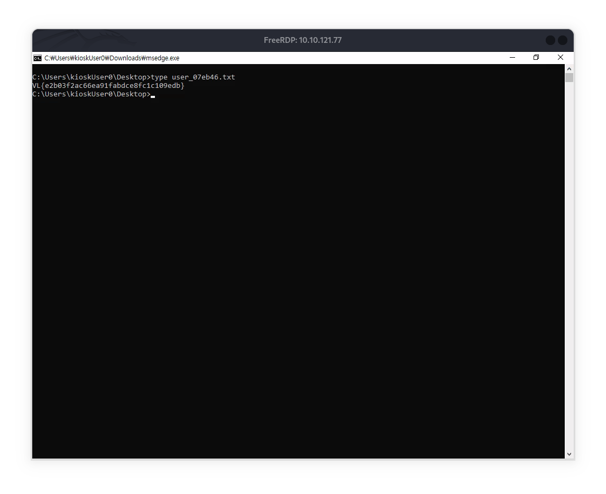
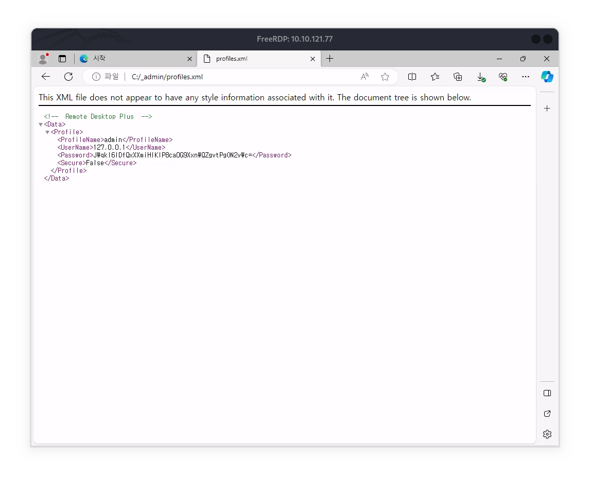
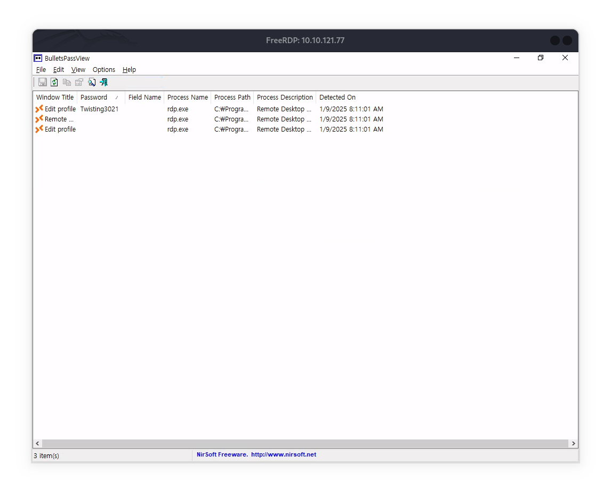
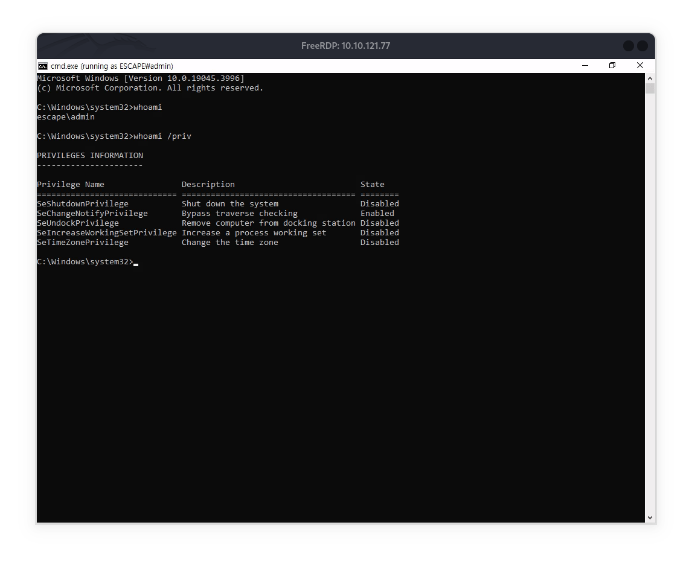
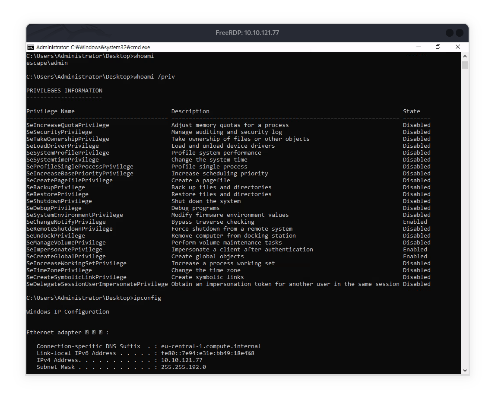

# KEY TAKE AWAYS

* KIOSK account break out


# NMAP

```
PORT     STATE SERVICE       REASON  VERSION
3389/tcp open  ms-wbt-server syn-ack Microsoft Terminal Services
| ssl-cert: Subject: commonName=Escape
| Issuer: commonName=Escape
|_ssl-date: 2024-06-24T12:37:45+00:00; +13s from scanner time.
| rdp-ntlm-info: 
|   Target_Name: ESCAPE
|   NetBIOS_Domain_Name: ESCAPE
|   NetBIOS_Computer_Name: ESCAPE
|   DNS_Domain_Name: Escape
|   DNS_Computer_Name: Escape
|   Product_Version: 10.0.19041
|_  System_Time: 2024-06-24T12:37:40+00:00
Service Info: OS: Windows; CPE: cpe:/o:microsoft:windows
```

# Foot Hold

```
xfreerdp /u:guest /v:<IP>

```


* we can naviget to `C:\Windows\system32\cmd.exe` , download it and then rename it as a known application such as `msedge` to evade the UAC
* since right click is disabled we can use f2


## System

* Evaluating the file system we find a RDP+  profile at `C:/_admin/profiles.xml` 

* we can load this onto the rdp.exe at `C:/Program Files(x86)/` but need to `cp` the profiles.exe to KioskUser0's Downloads folder
* once loaded we can run [bullets_password_view.exe](https://www.nirsoft.net/utils/bullets_password_view.html) to uncover the password from the rdp by editing the profile


* Then we can use cmd as admin via

```text
runas /user:admin cmd.exe
```


* Then we quickly notice that the User is under UAC
* To bypass UAC we have to get the UAC interaction menu since we are on RDP and hence we can do

```text
start-process cmd.exe -verb runas
```

